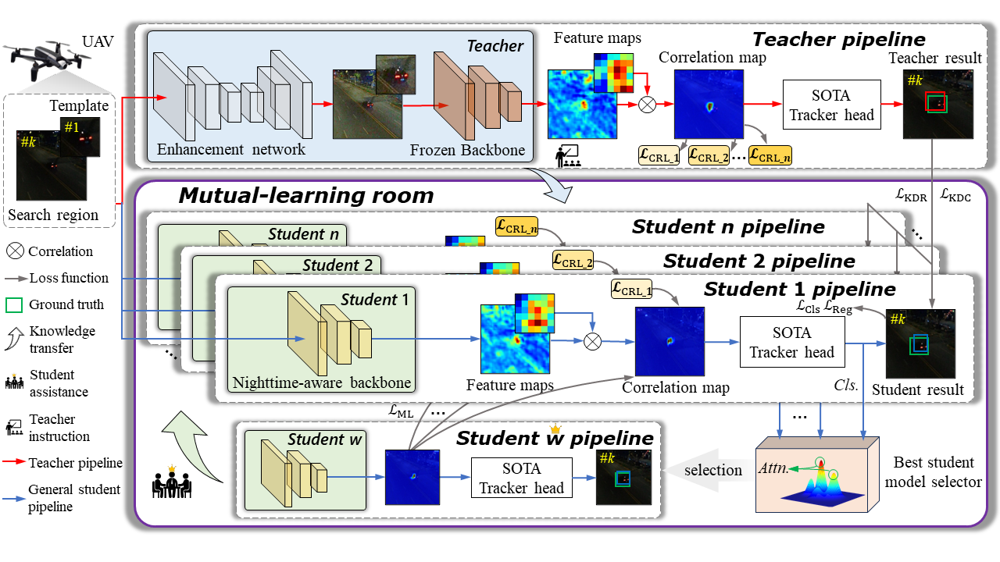

# [MLKD]

# Mutual-Learning Knowledge Distillation for Nighttime UAV Tracking

### Yufeng Liu

This is the official code for the paper "Mutual-Learning Knowledge Distillation for Nighttime UAV Tracking".

<!---->

# Abstract

Nighttime unmanned aerial vehicle (UAV) tracking has been facilitated with indispensable plug-and-play low-light enhancers.
However, the introduction of low-light enhancers increases the extra computational burden for the UAV, significantly hindering the development of real-time UAV applications.
Meanwhile, these state-of-the-art (SOTA) enhancers lack tight coupling with the advanced daytime UAV tracking approach.
To solve the above issues, this work proposes a novel mutual-learning knowledge distillation framework for nighttime UAV tracking, i.e., MLKD.
This framework is constructed to learn a compact and fast nighttime tracker via knowledge transferring from the teacher and knowledge sharing among various students.
Specifically, an advanced teacher based on a SOTA enhancer and a superior tracking backbone is adopted for guiding the student based only on the tight coupling-aware tracking backbone to directly extract nighttime object features.
To address the biased learning of a single student, diverse lightweight students with different distillation methods are constructed to focus on various aspects of the teacher's knowledge.
Moreover, an innovative mutual-learning room is designed to elect the superior student candidate to assist the remaining students frame-by-frame in the training phase.
Furthermore, the final best student, i.e., MLKD-Track, is selected through the testing dataset. 
Extensive experiments demonstrate the effectiveness and superiority of MLKD and MLKD-Track.
The practicality of the MLKD-Track is verified in real-world tests with different challenging situations.


## Environment Preparing

```
python 3.8.3
pytorch 1.11.0
```

## Demo
### Demo Video
[](https://www.youtube.com/watch?v=hzMocxhsKyY "MLKD")

## Train

Before training, you need to prepare the training set of the [NAT2021-test](https://vision4robotics.github.io/NAT2021/) and [DarkTrack2021](https://darktrack2021.netlify.app/) dataset. 
Also, the teacher model is based on the SOTA enhancer [DarkLighter](https://github.com/vision4robotics/DarkLighter) and the advanced tracker SiamRPN++(), the teacher model parameters can be gotten from [HERE](https://pan.baidu.com/s/10yEFjyitFMOMHaiHo8j9-Q?pwd=team)(code:team).
### Train the single-student model
Run train_kd.py.

```
CUDA_VISIBLE_DEVICES=0,1,2,3 python -m torch.distributed.launch --nproc_per_node=4 ./tools/train_kd.py --cfg experiments/siamrpn_alex_dwxcorr_16gpu/config.yaml 
```

### Train the mutual-learning student model
Run train_ml.py.

```
CUDA_VISIBLE_DEVICES=0,1,2,3 python -m torch.distributed.launch --nproc_per_node=4 ./tools/train_ml.py --cfg experiments/siamrpn_alex_dwxcorr_16gpu/config.yaml 
```

## Test

Download our pretrained model [MLKD-Track](https://pan.baidu.com/s/1zJUQdVNNwq1rV3Fb0Ar6Sg?pwd=mlkd)(code:mlkd).


Take the test of MLKD-Track as an example:

```
CUDA_VISIBLE_DEVICES="0" python tools/test.py --snapshot='/home/user/V4R/LYF/pysot-master2/snapshot/mlkd.pth'

```

## Evaluation 

If you want to evaluate the trackers mentioned above, please put those results into `results` directory as `results/<dataset_name>/<tracker_name>`.

```
python tools/eval.py                              
```

## Contact

If you have any questions, please contact me.

Yufeng Liu

Email: <2050520@tongji.edu.cn>.

## Acknowledgements
- The code is implemented based on [pysot](https://github.com/STVIR/pysot.git). We would like to express our sincere thanks to the contributors.
- We would also like to thank [SiamRPN++]() tracker and enhancer for their efforts.

